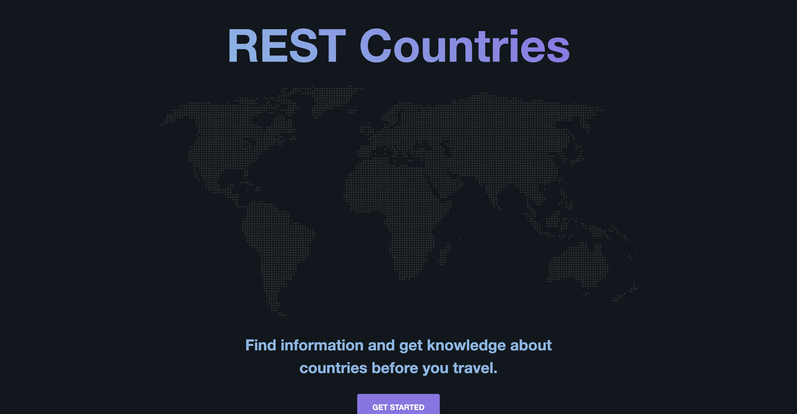

# REST Countries

The application allows you to search for countries and view detailed information about them.

## Purpose

The purpose of the application is to learn how to use Microsoft's Blazor framework (WebAssembly version) and use the popular [REST Countries API](https://restcountries.com/) to get data about countries.

## Demo

A demo is available at [https://rest-countries-wasm.vercel.app](https://rest-countries-wasm.vercel.app/).

## Screenshot

## Used technologies

- 🎁 Repository: regular Git repository,
- 🧰 Framework: Blazor (WebAssembly version),
- 🛠️ Tools: not yet,
- 🎨 Styling: regular CSS with BEM,
- 💎 Others: mobile-first, responsive design.

## How to start

1. Clone the repository,
2. Install .NET 5 SDK (or newer),
3. Install dependencies with `dotnet restore`,
4. Run the project with `dotnet run`.
